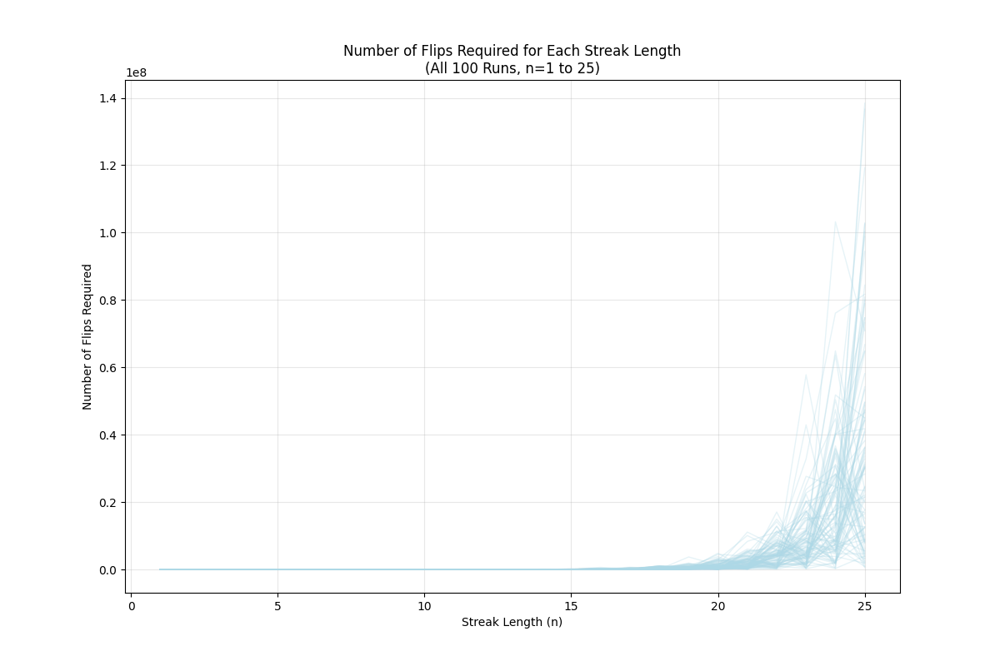
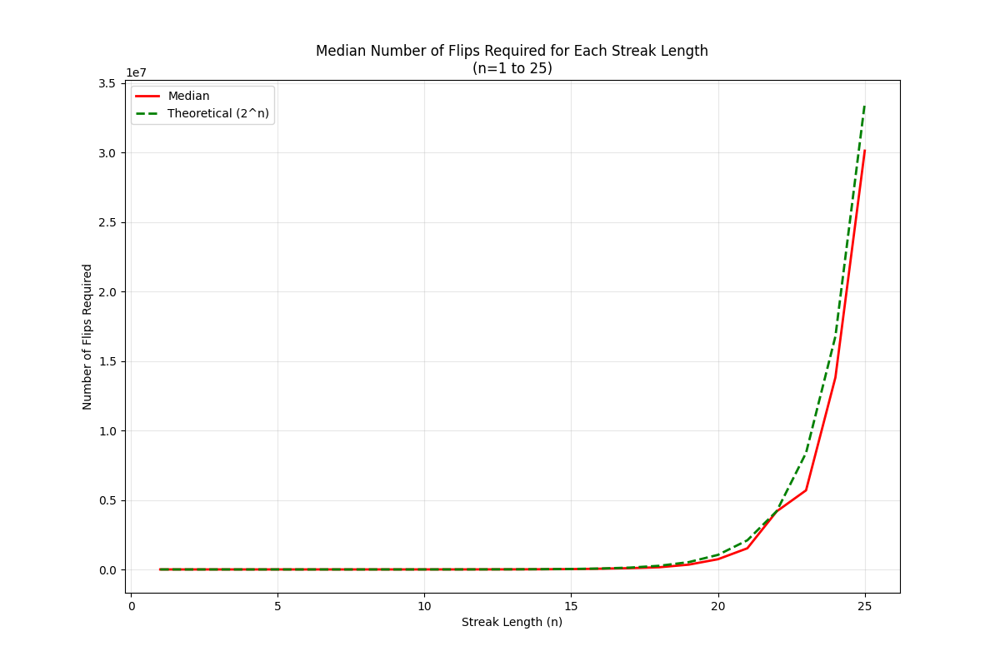
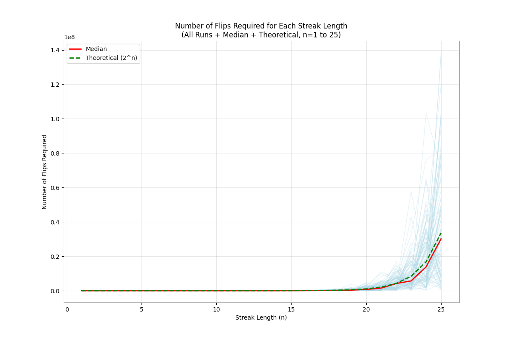
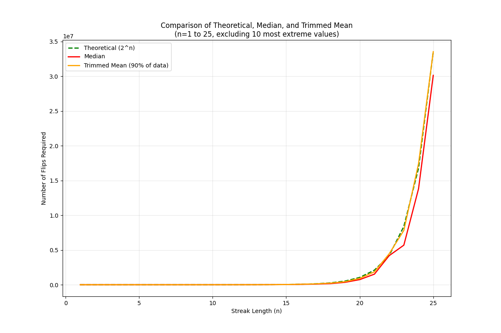
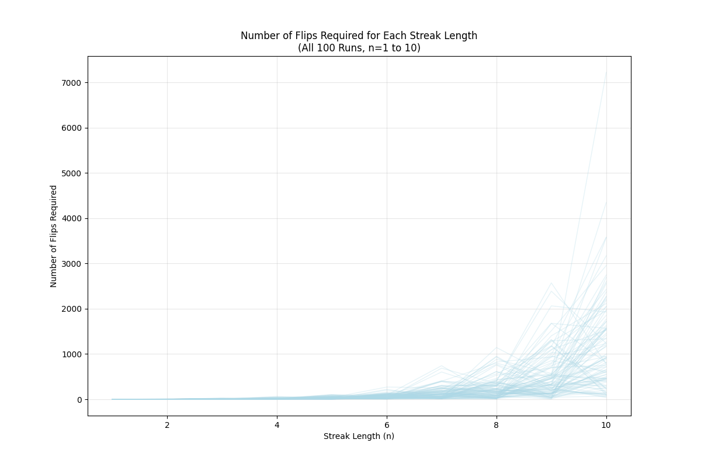
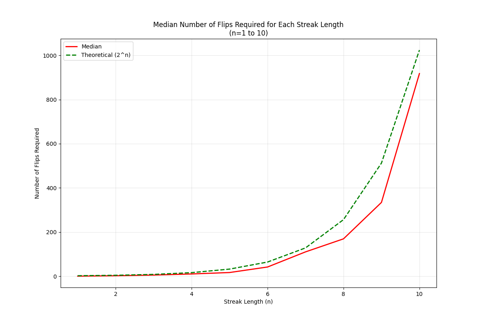
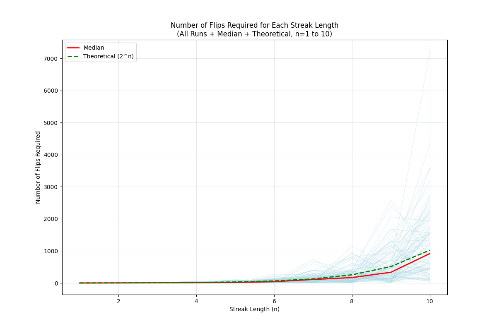
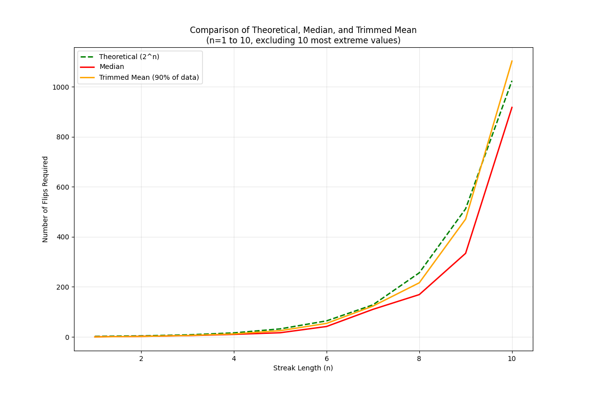

# Coin Flip Streak Analysis

This project investigates the probability of getting consecutive heads or tails in a series of coin flips. We analyze how many flips are required on average to achieve streaks of different lengths, comparing actual simulation results with theoretical expectations.

## Methodology

1. **Simulation Process**:
   - For each streak length n (from 1 to 25), we run 100 simulations
   - Each simulation continues until we achieve n consecutive heads or tails
   - We record the number of flips required for each simulation
   - Results are stored in a CSV file for analysis

2. **Theoretical Background**:
   - The theoretical expectation for achieving n consecutive heads or tails is approximately 2^n
   - This is because each additional flip in the streak has a 1/2 probability of matching

## Results Analysis

### 1. Individual Runs (n=1 to 25)

This plot shows all 100 simulation runs for each streak length. The light blue lines represent individual simulations, demonstrating the natural variation in the number of flips required to achieve each streak length.

### 2. Median and Theoretical Comparison (n=1 to 25)

This plot compares:
- The theoretical expectation (green dashed line): y = 2^n
- The median of all simulations (red line)

### 3. Combined View (n=1 to 25)

This plot shows all three elements together:
- Individual simulation runs (light blue)
- Median values (red)
- Theoretical expectation (green dashed)

### 4. Trimmed Analysis (n=1 to 25)

This plot focuses on the central 90% of the data by:
- Removing the 5 highest and 5 lowest values for each streak length
- Showing the theoretical expectation (green dashed)
- Showing the median (red)
- Showing the trimmed mean (orange)

### 5. Focused Analysis (n=1 to 10)
We also created focused versions of these plots for n=1 to 10 to better visualize the behavior at smaller streak lengths:

## Key Findings

1. **Theoretical vs. Actual**:
   - The theoretical expectation (2^n) provides a good approximation for smaller streak lengths
   - As streak length increases, the actual number of flips required tends to be higher than the theoretical expectation

2. **Variation in Results**:
   - There is significant variation in the number of flips required for longer streaks
   - The trimmed mean (excluding extreme values) helps identify the central tendency

3. **Pattern Recognition**:
   - The relationship between streak length and required flips appears exponential
   - The trimmed mean and median tend to follow similar patterns, suggesting the data is not heavily skewed

## Conclusion

This analysis demonstrates that while the theoretical expectation of 2^n provides a reasonable estimate for small streak lengths, the actual number of flips required tends to be higher for longer streaks. The variation in results increases with streak length, highlighting the probabilistic nature of the problem. The trimmed analysis helps identify the central tendency by removing extreme values that might skew the results.

## Files in the Project

- `longest_streak_finder.py`: Main simulation script
- `analyze_streak_results.py`: Analysis and visualization script
- `streak_simulation_results_*.csv`: Simulation data files
- Various PNG files containing the plots 