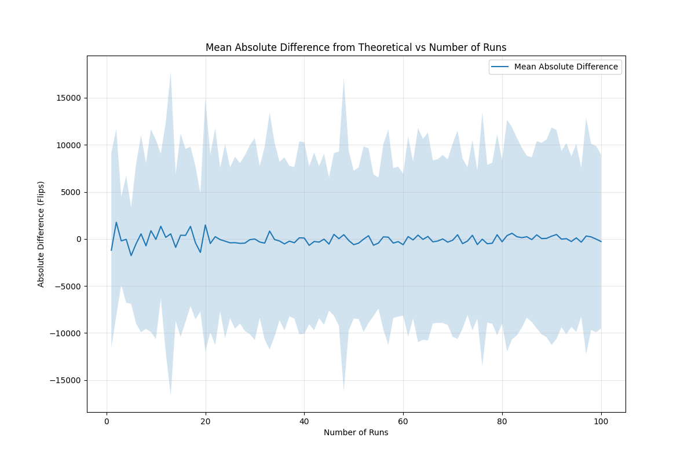
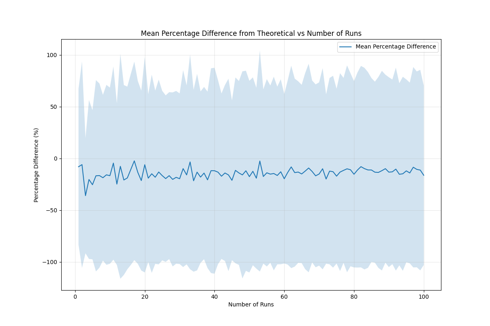

# Coin Flip Streak Analysis

This project investigates the probability of getting consecutive heads or tails in a series of coin flips. We analyze how many flips are required on average to achieve streaks of different lengths, comparing actual simulation results with theoretical expectations.

## Project Structure

```
Coin_statistics/
├── analyze_streak_results.py    # Analysis and visualization script
├── run_progressive_analysis.py  # Progressive simulation script
├── results/
│   ├── results_20250419/       # Main results directory
│   │   ├── results_100/        # 100 runs analysis
│   │   ├── results_1000/       # 1000 runs analysis
│   │   └── results_10000/      # 10000 runs analysis
│   └── results_20250419_progressive/  # Progressive analysis results
│       ├── progressive_simulation_results_*.csv
│       ├── progressive_analysis_stats.csv
│       ├── absolute_difference_vs_runs.png
│       └── percentage_difference_vs_runs.png
└── README.md
```

## Methodology

1. **Simulation Process**:
   - For each streak length n (from 1 to 25), we run multiple simulations
   - Each simulation continues until we achieve n consecutive heads or tails
   - We record the number of flips required for each simulation
   - Results are stored in CSV files for analysis

2. **Theoretical Background**:
   - The theoretical expectation for achieving n consecutive heads or tails is approximately 2^n
   - This is because each additional flip in the streak has a 1/2 probability of matching

## Results Analysis

### 1. Individual Runs (n=1 to 25)

This plot shows all simulation runs for each streak length. The light blue lines represent individual simulations, demonstrating the natural variation in the number of flips required to achieve each streak length.

### 2. Median and Theoretical Comparison (n=1 to 25)

This plot compares:
- The theoretical expectation (green dashed line): y = 2^n
- The median of all simulations (red line)

### 3. Combined View (n=1 to 25)

This plot shows all three elements together:
- Individual simulation runs (light blue)
- Median values (red)
- Theoretical expectation (green dashed)

### 4. Trimmed Analysis (n=1 to 25)

This plot focuses on the central 90% of the data by:
- Removing the 5 highest and 5 lowest values for each streak length
- Showing the theoretical expectation (green dashed)
- Showing the median (red)
- Showing the trimmed mean (orange)

### 5. Run Size Comparison
We analyzed how different numbers of simulation runs affect the results:

#### 100 vs 1000 vs 10000 Runs Comparison

This plot compares the median number of flips required across different run sizes:
- 100 runs (blue)
- 1000 runs (orange)
- 10000 runs (green)
- Theoretical expectation (red dashed)

The plot shows that:
- Larger run sizes provide more stable estimates
- The 1000 and 10000 run results are very similar
- All run sizes show consistent deviation from theoretical predictions

#### Percentage Difference by Run Size

This plot shows the percentage difference from theoretical values for each run size:
- 100 runs (blue)
- 1000 runs (orange)
- 10000 runs (green)

Key observations:
- All run sizes show consistent underestimation by the theoretical model
- The percentage difference increases with streak length
- Larger run sizes show more stable percentage differences

### 6. Progressive Analysis
We conducted a progressive analysis to understand how the number of simulation runs affects the accuracy of our results:

#### Absolute Difference vs Number of Runs

This plot shows how the absolute difference between simulated and theoretical values changes as we increase the number of runs. The shaded area represents the standard deviation, showing the variation in results.

#### Percentage Difference vs Number of Runs

This plot shows the percentage difference between simulated and theoretical values as a function of the number of runs. The error bars indicate the standard deviation of the percentage differences.

## Key Findings

1. **Theoretical vs. Actual**:
   - The theoretical expectation (2^n) provides a good approximation for smaller streak lengths
   - As streak length increases, the actual number of flips required tends to be higher than the theoretical expectation

2. **Variation in Results**:
   - There is significant variation in the number of flips required for longer streaks
   - The trimmed mean (excluding extreme values) helps identify the central tendency

3. **Run Size Effects**:
   - Larger run sizes (1000+) provide more stable and reliable results
   - The difference between 1000 and 10000 runs is minimal
   - 100 runs show more variation but follow the same general pattern

4. **Progressive Analysis Insights**:
   - The absolute difference between simulated and theoretical values increases with streak length
   - The percentage difference shows that the theoretical model consistently underestimates the required flips
   - The standard deviation decreases as the number of runs increases, indicating more stable results

5. **Pattern Recognition**:
   - The relationship between streak length and required flips appears exponential
   - The trimmed mean and median tend to follow similar patterns, suggesting the data is not heavily skewed

## Conclusion

This analysis demonstrates that while the theoretical expectation of 2^n provides a reasonable estimate for small streak lengths, the actual number of flips required tends to be higher for longer streaks. The progressive analysis shows that increasing the number of simulation runs leads to more stable and reliable results, with the theoretical model consistently underestimating the required number of flips. The variation in results increases with streak length, highlighting the probabilistic nature of the problem.

## Files in the Project

- `analyze_streak_results.py`: Analysis and visualization script
- `run_progressive_analysis.py`: Progressive simulation script
- `results/results_20250419/`: Directory containing main simulation results
- `results/results_20250419_progressive/`: Directory containing progressive analysis results
- Various PNG files containing the plots 