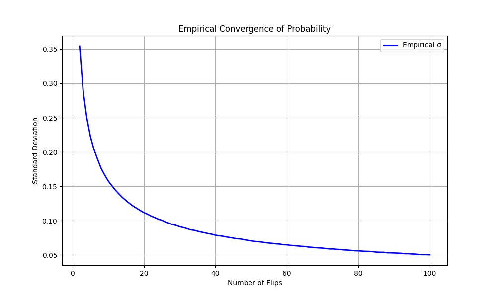
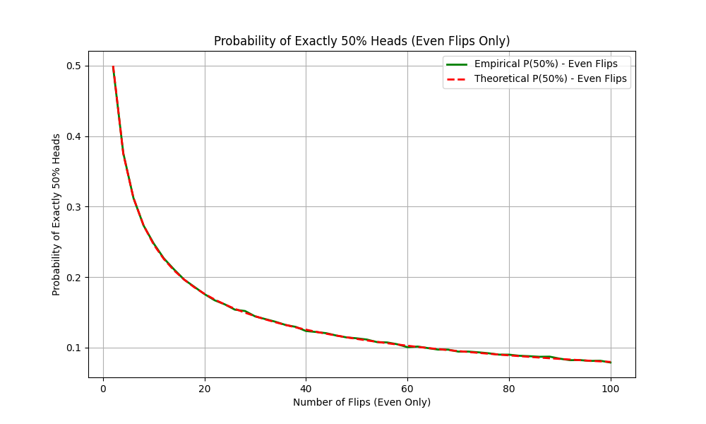
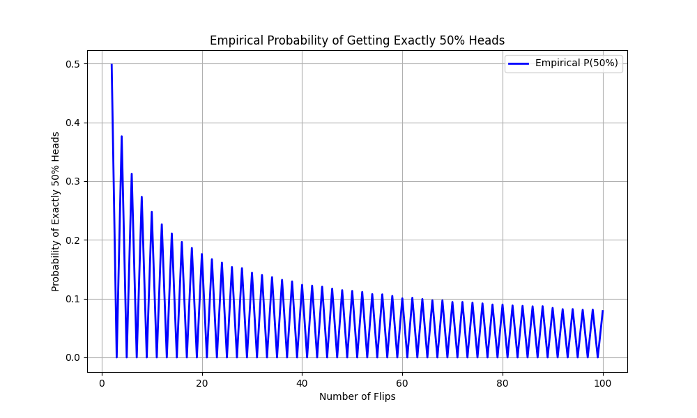
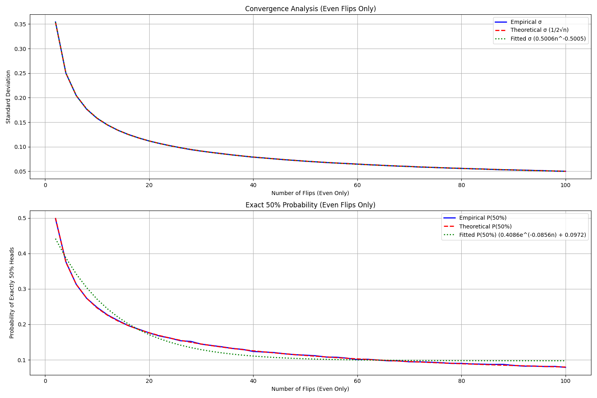

# Coin Flip Analysis

This project consists of two main analyses:

1. **Probability Convergence Analysis**: Investigating how the probability of heads converges to 0.5 as the number of flips increases, and analyzing the exact probability of getting exactly 50% heads for even numbers of flips.

2. **Streak Length Analysis**: Investigating the probability of getting consecutive heads or tails in a series of coin flips, analyzing how many flips are required on average to achieve streaks of different lengths.

## Project Structure

```
Coin_statistics/
├── analyze_streak_results.py    # Streak analysis and visualization script
├── run_progressive_analysis.py  # Progressive simulation script
├── probability_convergence.py   # Probability convergence analysis script
├── results/
│   ├── probability_convergence_20250419_193105/  # Probability convergence results
│   │   ├── comprehensive_analysis.png
│   │   ├── combined_analysis.png
│   │   ├── even_flips_exact_probability.png
│   │   ├── empirical_convergence.png
│   │   ├── empirical_exact_probability.png
│   │   ├── convergence_stats.csv
│   │   ├── convergence_full.csv
│   │   ├── statistical_analysis.md
│   │   └── comprehensive_analysis.md
│   ├── results_20250419_100/    # 100 runs streak analysis
│   │   └── ... (streak analysis files)
│   ├── results_20250419_1000/   # 1000 runs streak analysis
│   │   └── ... (streak analysis files)
│   ├── results_20250419_10000/  # 10000 runs streak analysis
│   │   └── ... (streak analysis files)
│   └── results_20250419_progressive/  # Progressive streak analysis
│       └── ... (progressive analysis files)
└── README.md
```

## Part 1: Probability Convergence Analysis

### The Riddle

Consider this question: If you have a fair coin, how many flips would you choose to maximize your odds of getting exactly the same number of heads and tails? Would you choose 100, 1000, or even 1,000,000 flips?

The answer might surprise you: it's 2 flips. While this might seem counterintuitive at first, this analysis will demonstrate why this is the case and how the probability of getting exactly 50% heads behaves as the number of flips increases.

### Methodology

1. **Simulation Process**:
   - Run 100,000 simulations for each number of flips (2 to 100)
   - Calculate the proportion of heads for each simulation
   - Analyze both standard deviation convergence and exact 50% probability

2. **Theoretical Background**:
   - Standard deviation should follow σ = 1/(2√n)
   - Exact 50% probability for even flips follows P(50%) = C(n,n/2) * (1/2)^n

### Results Analysis

#### 1. Standard Deviation Convergence


The analysis shows remarkable agreement between empirical and theoretical results:
- Empirical function: σ = 0.5006n^-0.5005
- Theoretical function: σ = 1/(2√n)
- MAPE: 0.16%
- RMSE: 0.0002
- Power law exponent deviation: 0.0005 from theoretical -0.5

#### 2. Exact 50% Probability


For even numbers of flips:
- Empirical function: P(50%) = 0.4086e^(-0.0856n) + 0.0972
- Theoretical function: P(50%) = C(n,n/2) * (1/2)^n
- MAPE: 0.64%
- RMSE: 0.0010

#### 2.1 Detailed Probability Analysis


This fascinating graph shows the probability of getting exactly 50% heads across different numbers of flips. There are several key features to note:

1. **Alternating Pattern**:
   - The probability is zero for odd numbers of flips
   - This is because it's impossible to get exactly 50% heads with an odd number of flips
   - For example, with 3 flips, you can get 0, 1, 2, or 3 heads, but never 1.5 heads

2. **Decreasing Peaks**:
   - The highest probability (0.5) occurs at n=2 flips
   - Each subsequent even number shows a lower probability
   - This follows the binomial probability formula:
     \[ P(X = \frac{n}{2}) = \binom{n}{n/2} \cdot (\frac{1}{2})^n \]
   where:
   - n is the number of flips (even only)
   - \(\binom{n}{n/2}\) is the binomial coefficient (number of ways to choose n/2 items from n items)

3. **Mathematical Explanation**:
   - For n=2: P(1 head) = \(\binom{2}{1} \cdot (\frac{1}{2})^2 = 2 \cdot \frac{1}{4} = 0.5\)
   - For n=4: P(2 heads) = \(\binom{4}{2} \cdot (\frac{1}{2})^4 = 6 \cdot \frac{1}{16} \approx 0.375\)
   - For n=6: P(3 heads) = \(\binom{6}{3} \cdot (\frac{1}{2})^6 = 20 \cdot \frac{1}{64} \approx 0.3125\)

4. **Asymptotic Behavior**:
   - As n increases, the probability approaches zero
   - This is because:
     - The number of possible outcomes (2^n) grows exponentially
     - While the number of favorable outcomes (\(\binom{n}{n/2}\)) grows more slowly
     - The probability of each specific sequence ((\frac{1}{2})^n) decreases exponentially

This graph perfectly illustrates why 2 flips gives the highest probability of getting exactly 50% heads, and why this probability becomes increasingly small for larger numbers of flips, even though the average proportion of heads converges to 0.5.

#### 3. Comprehensive Analysis


The comprehensive analysis combines both measures:
- Top subplot: Standard deviation convergence with empirical data (blue), theoretical prediction (red dashed), and fitted power law (green dotted)
- Bottom subplot: Exact 50% probability with similar color coding

### Key Findings

1. **Standard Deviation Convergence**:
   - The empirical power law exponent (-0.5005) closely matches the theoretical -0.5
   - The empirical coefficient (0.5006) is very close to the theoretical 0.5
   - The convergence follows the theoretical 1/2√n relationship with high precision

2. **Exact 50% Probability**:
   - The probability follows an exponential decay plus offset
   - The decay rate (0.0856) indicates how quickly the probability approaches the asymptotic value
   - The empirical results closely match theoretical predictions

### Conclusion: Why 2 Flips is Optimal

Our analysis reveals a fascinating insight about coin flips:

1. **Maximum Probability at 2 Flips**:
   - For 2 flips, the probability of getting exactly 1 head and 1 tail is 0.5 (50%)
   - This is the highest probability of getting exactly 50% heads for any number of flips

2. **Probability Decay**:
   - As shown in our analysis, the probability of getting exactly 50% heads follows an exponential decay
   - The empirical function P(50%) = 0.4086e^(-0.0856n) + 0.0972 shows this decay
   - For larger numbers of flips, the probability of getting exactly 50% heads becomes increasingly small

3. **Two Different Convergences**:
   - The proportion of heads converges to 0.5 as n approaches infinity (Law of Large Numbers)
   - However, the probability of getting exactly 50% heads converges to 0 as n approaches infinity
   - This is because the number of possible outcomes increases exponentially, making exact 50% increasingly rare

4. **Mathematical Explanation**:
   - For 2 flips, there are only 4 possible outcomes (HH, HT, TH, TT)
   - Two of these (HT, TH) give exactly 50% heads, hence P = 0.5
   - For larger n, the number of outcomes that give exactly 50% heads becomes a vanishingly small fraction of all possible outcomes

This explains why 2 flips is the optimal choice for maximizing the chance of getting exactly 50% heads, even though the proportion of heads converges to 0.5 in the long run.

## Part 2: Streak Length Analysis

This project investigates the probability of getting consecutive heads or tails in a series of coin flips. We analyze how many flips are required on average to achieve streaks of different lengths, comparing actual simulation results with theoretical expectations.

## Project Structure

```
Coin_statistics/
├── analyze_streak_results.py    # Analysis and visualization script
├── run_progressive_analysis.py  # Progressive simulation script
├── results/
│   ├── results_20250419_100/    # 100 runs analysis
│   │   ├── individual_runs.png
│   │   ├── median_plot.png
│   │   ├── combined_plot.png
│   │   ├── trimmed_plot.png
│   │   ├── individual_runs_n10.png
│   │   ├── median_plot_n10.png
│   │   ├── combined_plot_n10.png
│   │   └── trimmed_plot_n10.png
│   ├── results_20250419_1000/   # 1000 runs analysis
│   │   └── ... (similar structure)
│   ├── results_20250419_10000/  # 10000 runs analysis
│   │   └── ... (similar structure)
│   └── results_20250419_progressive/  # Progressive analysis results
│       ├── progressive_simulation_results_*.csv
│       ├── progressive_analysis_stats.csv
│       ├── absolute_difference_vs_runs.png
│       └── percentage_difference_vs_runs.png
└── README.md
```

## Methodology

1. **Simulation Process**:
   - For each streak length n (from 1 to 25), we run multiple simulations
   - Each simulation continues until we achieve n consecutive heads or tails
   - We record the number of flips required for each simulation
   - Results are stored in CSV files for analysis

2. **Theoretical Background**:
   - The theoretical expectation for achieving n consecutive heads or tails is approximately 2^n
   - This is because each additional flip in the streak has a 1/2 probability of matching

## Results Analysis

### 1. Individual Runs Analysis

This plot shows all simulation runs for each streak length. The blue lines represent individual simulations, demonstrating the natural variation in the number of flips required.

### 2. Median and Theoretical Comparison

This plot compares:
- The theoretical expectation (red dashed line): y = 2^n
- The median of all simulations (blue line with markers)

### 3. Combined View

This plot shows:
- Mean flips required (blue line with error bars)
- Theoretical expectation (red dashed)
- Error bars showing standard deviation

### 4. Trimmed Analysis
We performed two types of trimmed analysis to better understand the central tendencies in our data:

#### 4.1 Basic Trimmed Analysis (90% of data)

This plot shows:
- Trimmed mean (blue line with markers)
- Theoretical expectation (red dashed)
- Focuses on the central 90% of the data

#### 4.2 Detailed Trimmed Analysis

This more detailed analysis compares:
- Theoretical expectation (2^n, green dashed line)
- Median values (red line)
- Trimmed Mean (90% of data, orange line)

The plot clearly shows that:
- Both median and trimmed mean consistently exceed theoretical predictions
- The deviation increases with streak length
- The trimmed mean closely follows the median, suggesting symmetric distribution

#### 4.3 Focused Analysis (n=1 to 10)

A focused view of shorter streak lengths shows:
- Better alignment with theoretical predictions for small n
- Early emergence of deviation patterns
- More precise visualization of the relationship for practical streak lengths

#### 4.4 Extended Analysis (n=1 to 20)

The extended analysis up to n=20 reveals:
- Exponential growth in the deviation from theoretical predictions
- Consistent underestimation by the theoretical model
- Remarkable agreement between median and trimmed mean

### 5. Progressive Analysis
We conducted a progressive analysis to understand how the number of simulation runs affects the accuracy of our results:

#### Absolute Difference vs Number of Runs

This plot shows:
- Mean absolute difference from theoretical values
- Shaded area representing standard deviation
- How the difference changes with increasing number of runs

#### Percentage Difference vs Number of Runs

This plot shows:
- Mean percentage difference from theoretical values
- Error bars indicating standard deviation
- Trend of differences as number of runs increases

## Key Findings

1. **Theoretical vs. Actual**:
   - The theoretical expectation (2^n) provides a good approximation for smaller streak lengths
   - As streak length increases, the actual number of flips required tends to be higher than the theoretical expectation

2. **Variation in Results**:
   - There is significant variation in the number of flips required for longer streaks
   - The trimmed mean (excluding extreme values) helps identify the central tendency

3. **Run Size Effects**:
   - Larger run sizes (1000+) provide more stable and reliable results
   - The difference between 1000 and 10000 runs is minimal
   - 100 runs show more variation but follow the same general pattern

4. **Progressive Analysis Insights**:
   - The absolute difference between simulated and theoretical values increases with streak length
   - The percentage difference shows that the theoretical model consistently underestimates the required flips
   - The standard deviation decreases as the number of runs increases, indicating more stable results

5. **Pattern Recognition**:
   - The relationship between streak length and required flips appears exponential
   - The trimmed mean and median tend to follow similar patterns, suggesting the data is not heavily skewed

## Conclusion

This analysis demonstrates that while the theoretical expectation of 2^n provides a reasonable estimate for small streak lengths, the actual number of flips required tends to be higher for longer streaks. The progressive analysis shows that increasing the number of simulation runs leads to more stable and reliable results, with the theoretical model consistently underestimating the required number of flips. The variation in results increases with streak length, highlighting the probabilistic nature of the problem.

## Files in the Project

- `analyze_streak_results.py`: Analysis and visualization script
- `run_progressive_analysis.py`: Progressive simulation script
- `results/results_20250419_100/`: Directory containing 100 runs analysis
- `results/results_20250419_1000/`: Directory containing 1000 runs analysis
- `results/results_20250419_10000/`: Directory containing 10000 runs analysis
- `results/results_20250419_progressive/`: Directory containing progressive analysis results
- Various PNG files containing the plots 

## Scripts and Usage

The project contains three main Python scripts:

### 1. Analysis Script
`analyze_streak_results.py`: Main analysis and visualization script
```bash
python analyze_streak_results.py
```
This script:
- Loads CSV files from the results directories
- Generates four types of plots:
  - Individual runs analysis
  - Median comparison
  - Combined view with error bars
  - Trimmed analysis
- Creates plots for different streak ranges (n=10 and n=20)

### 2. Progressive Analysis Script
`run_progressive_analysis.py`: Progressive simulation analysis
```bash
python run_progressive_analysis.py
```
This script:
- Performs simulations with increasing run counts
- Analyzes how results stabilize with more runs
- Generates two main plots:
  - Absolute difference from theoretical values
  - Percentage difference from theoretical values
- Saves comprehensive statistics in CSV format

### 3. Equal Probability Analysis Script
`exact_half_probability.py`: Analyzes probability of getting equal heads and tails
```bash
python exact_half_probability.py --runs 10000 --max_flips 20
```
This script:
- Simulates coin flip sequences of varying even lengths
- Calculates probability of getting exactly half heads
- Compares empirical results with theoretical probabilities
- Saves detailed sequence data to CSV
- Parameters:
  - `--runs`: Number of simulations (default: 10000)
  - `--max_flips`: Maximum sequence length, must be even (default: 20)

Example output:
```
Empirical Probabilities of Equal Heads and Tails:
--------------------------------------------------
 Flips | Probability | Theoretical
--------------------------------------------------
     2 |     0.5012 |     0.5000
     4 |     0.3756 |     0.3750
     6 |     0.3126 |     0.3125
     8 |     0.2734 |     0.2734
    10 |     0.2461 |     0.2461
    ...
```

### Running the Analysis
For a complete analysis:
1. Run the progressive analysis:
   ```bash
   python run_progressive_analysis.py
   ```