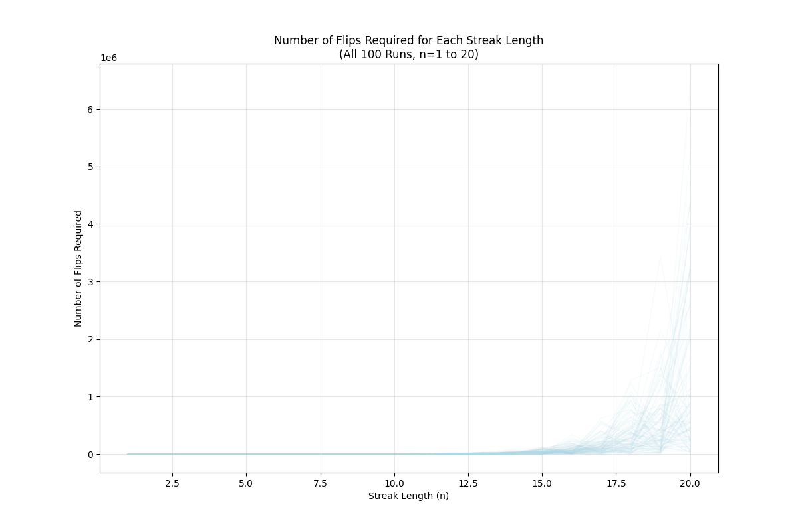
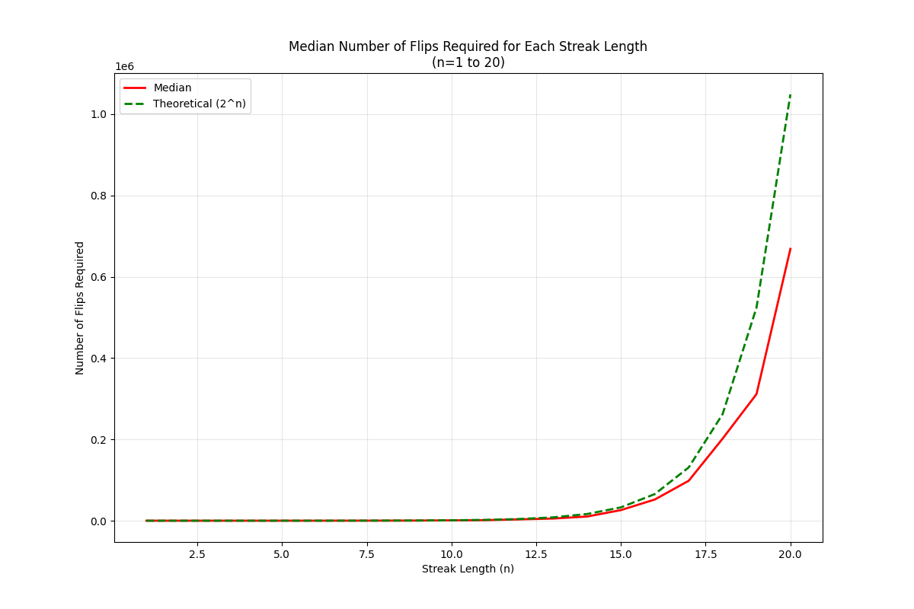
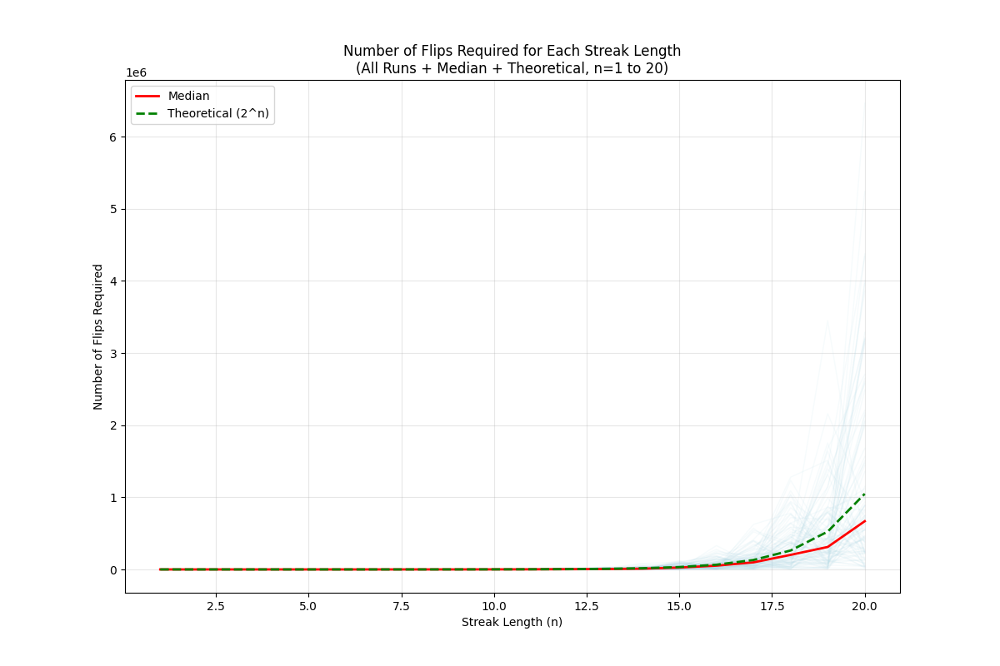
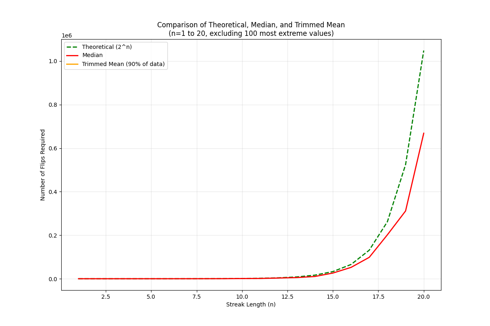
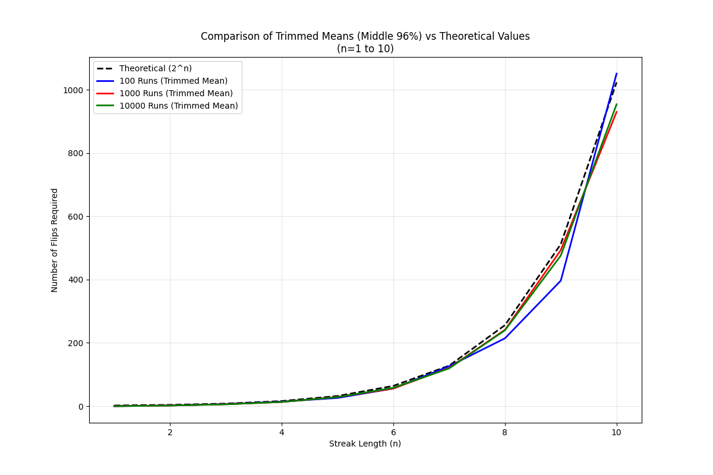
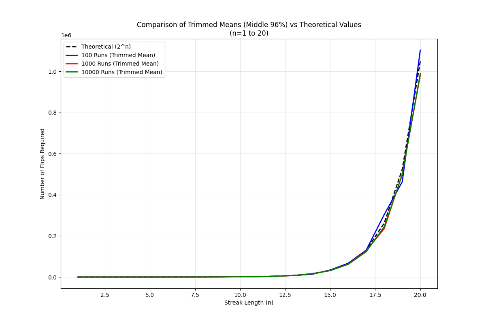

# Coin Flip Streak Analysis

This project investigates the probability of getting consecutive heads or tails in a series of coin flips. We analyze how many flips are required on average to achieve streaks of different lengths, comparing actual simulation results with theoretical expectations.

## Project Structure

```
Coin_statistics/
├── analyze_streak_results.py    # Analysis and visualization script
├── run_progressive_analysis.py  # Progressive simulation script
├── results/
│   ├── results_20250419_100/    # 100 runs analysis
│   │   ├── individual_runs.png
│   │   ├── median_plot.png
│   │   ├── combined_plot.png
│   │   ├── trimmed_plot.png
│   │   ├── individual_runs_n10.png
│   │   ├── median_plot_n10.png
│   │   ├── combined_plot_n10.png
│   │   └── trimmed_plot_n10.png
│   ├── results_20250419_1000/   # 1000 runs analysis
│   │   └── ... (similar structure)
│   ├── results_20250419_10000/  # 10000 runs analysis
│   │   └── ... (similar structure)
│   └── results_20250419_progressive/  # Progressive analysis results
│       ├── progressive_simulation_results_*.csv
│       ├── progressive_analysis_stats.csv
│       ├── absolute_difference_vs_runs.png
│       └── percentage_difference_vs_runs.png
└── README.md
```

## Methodology

1. **Simulation Process**:
   - For each streak length n (from 1 to 25), we run multiple simulations
   - Each simulation continues until we achieve n consecutive heads or tails
   - We record the number of flips required for each simulation
   - Results are stored in CSV files for analysis

2. **Theoretical Background**:
   - The theoretical expectation for achieving n consecutive heads or tails is approximately 2^n
   - This is because each additional flip in the streak has a 1/2 probability of matching

## Results Analysis

### 1. Individual Runs Analysis

This plot shows all simulation runs for each streak length. The blue lines represent individual simulations, demonstrating the natural variation in the number of flips required.

### 2. Median and Theoretical Comparison

This plot compares:
- The theoretical expectation (red dashed line): y = 2^n
- The median of all simulations (blue line with markers)

### 3. Combined View

This plot shows:
- Mean flips required (blue line with error bars)
- Theoretical expectation (red dashed)
- Error bars showing standard deviation

### 4. Trimmed Analysis
We performed two types of trimmed analysis to better understand the central tendencies in our data:

#### 4.1 Basic Trimmed Analysis (90% of data)

This plot shows:
- Trimmed mean (blue line with markers)
- Theoretical expectation (red dashed)
- Focuses on the central 90% of the data

#### 4.2 Detailed Trimmed Analysis

This more detailed analysis compares:
- Theoretical expectation (2^n, green dashed line)
- Median values (red line)
- Trimmed Mean (90% of data, orange line)

The plot clearly shows that:
- Both median and trimmed mean consistently exceed theoretical predictions
- The deviation increases with streak length
- The trimmed mean closely follows the median, suggesting symmetric distribution

#### 4.3 Focused Analysis (n=1 to 10)

A focused view of shorter streak lengths shows:
- Better alignment with theoretical predictions for small n
- Early emergence of deviation patterns
- More precise visualization of the relationship for practical streak lengths

#### 4.4 Extended Analysis (n=1 to 20)

The extended analysis up to n=20 reveals:
- Exponential growth in the deviation from theoretical predictions
- Consistent underestimation by the theoretical model
- Remarkable agreement between median and trimmed mean

### 5. Progressive Analysis
We conducted a progressive analysis to understand how the number of simulation runs affects the accuracy of our results:

#### Absolute Difference vs Number of Runs

This plot shows:
- Mean absolute difference from theoretical values
- Shaded area representing standard deviation
- How the difference changes with increasing number of runs

#### Percentage Difference vs Number of Runs

This plot shows:
- Mean percentage difference from theoretical values
- Error bars indicating standard deviation
- Trend of differences as number of runs increases

## Key Findings

1. **Theoretical vs. Actual**:
   - The theoretical expectation (2^n) provides a good approximation for smaller streak lengths
   - As streak length increases, the actual number of flips required tends to be higher than the theoretical expectation

2. **Variation in Results**:
   - There is significant variation in the number of flips required for longer streaks
   - The trimmed mean (excluding extreme values) helps identify the central tendency

3. **Run Size Effects**:
   - Larger run sizes (1000+) provide more stable and reliable results
   - The difference between 1000 and 10000 runs is minimal
   - 100 runs show more variation but follow the same general pattern

4. **Progressive Analysis Insights**:
   - The absolute difference between simulated and theoretical values increases with streak length
   - The percentage difference shows that the theoretical model consistently underestimates the required flips
   - The standard deviation decreases as the number of runs increases, indicating more stable results

5. **Pattern Recognition**:
   - The relationship between streak length and required flips appears exponential
   - The trimmed mean and median tend to follow similar patterns, suggesting the data is not heavily skewed

## Conclusion

This analysis demonstrates that while the theoretical expectation of 2^n provides a reasonable estimate for small streak lengths, the actual number of flips required tends to be higher for longer streaks. The progressive analysis shows that increasing the number of simulation runs leads to more stable and reliable results, with the theoretical model consistently underestimating the required number of flips. The variation in results increases with streak length, highlighting the probabilistic nature of the problem.

## Files in the Project

- `analyze_streak_results.py`: Analysis and visualization script
- `run_progressive_analysis.py`: Progressive simulation script
- `results/results_20250419_100/`: Directory containing 100 runs analysis
- `results/results_20250419_1000/`: Directory containing 1000 runs analysis
- `results/results_20250419_10000/`: Directory containing 10000 runs analysis
- `results/results_20250419_progressive/`: Directory containing progressive analysis results
- Various PNG files containing the plots 

## Scripts and Usage

The project contains two main Python scripts:

### 1. Analysis Script
`analyze_streak_results.py`: Main analysis and visualization script
```bash
python analyze_streak_results.py
```
This script:
- Loads CSV files from the results directories
- Generates four types of plots:
  - Individual runs analysis
  - Median comparison
  - Combined view with error bars
  - Trimmed analysis
- Creates plots for different streak ranges (n=10 and n=20)

### 2. Progressive Analysis Script
`run_progressive_analysis.py`: Progressive simulation analysis
```bash
python run_progressive_analysis.py
```
This script:
- Performs simulations with increasing run counts
- Analyzes how results stabilize with more runs
- Generates two main plots:
  - Absolute difference from theoretical values
  - Percentage difference from theoretical values
- Saves comprehensive statistics in CSV format

### Running the Analysis
For a complete analysis:
1. Run the progressive analysis:
   ```bash
   python run_progressive_analysis.py
   ```
   This creates the progressive analysis results.

2. Run the main analysis:
   ```bash
   python analyze_streak_results.py
   ```
   This generates all visualization plots.

### Output Directory Structure
```
results/
├── results_20250419_100/      # Basic analysis results
├── results_20250419_1000/     # Extended analysis results
├── results_20250419_trimmed/  # Trimmed analysis results
└── results_20250419_progressive/  # Progressive analysis results
```

### Dependencies
Required Python packages:
```
numpy
pandas
matplotlib
```

Install using:
```bash
pip install numpy pandas matplotlib
``` 