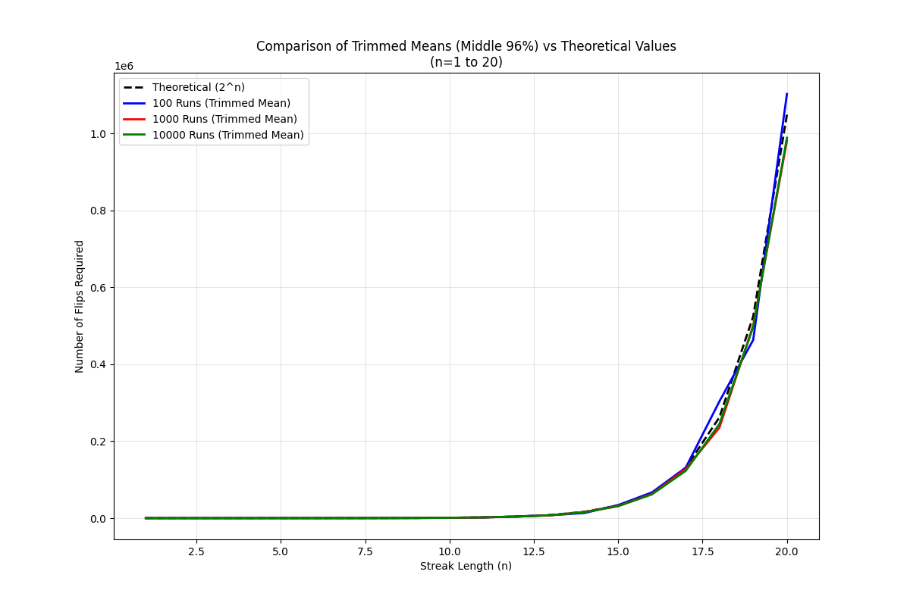
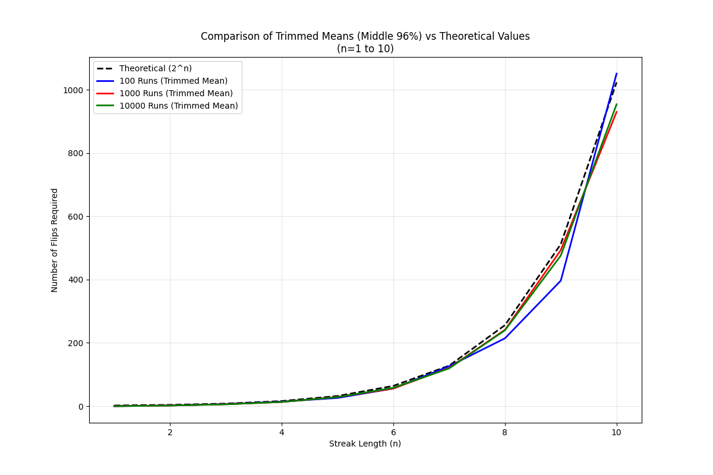

# Coin Flip Streak Analysis

This project analyzes the relationship between streak length and the number of flips required to achieve that streak in a fair coin toss experiment. The analysis compares theoretical predictions with empirical results from Monte Carlo simulations.

## Project Structure

```
Coin_statistics/
├── README.md
├── analyze_streak_results.py
├── analyze_trimmed_data.py
├── streak_simulation.py
├── longest_streak_finder.py
├── requirements.txt
├── results_20250419/
│   ├── streak_simulation_results_005753.csv  # 100 runs
│   ├── streak_simulation_results_005858.csv  # 1000 runs
│   └── streak_simulation_results_010926.csv  # 10000 runs
├── results_20250419_100/
│   ├── individual_runs.png
│   ├── median_plot.png
│   ├── combined_plot.png
│   ├── trimmed_plot.png
│   ├── individual_runs_n10.png
│   ├── median_plot_n10.png
│   ├── combined_plot_n10.png
│   └── trimmed_plot_n10.png
├── results_20250419_1000/
│   ├── individual_runs.png
│   ├── median_plot.png
│   ├── combined_plot.png
│   ├── trimmed_plot.png
│   ├── individual_runs_n10.png
│   ├── median_plot_n10.png
│   ├── combined_plot_n10.png
│   └── trimmed_plot_n10.png
├── results_20250419_10000/
│   ├── individual_runs.png
│   ├── median_plot.png
│   ├── combined_plot.png
│   ├── trimmed_plot.png
│   ├── individual_runs_n10.png
│   ├── median_plot_n10.png
│   ├── combined_plot_n10.png
│   └── trimmed_plot_n10.png
└── results_20250419_trimmed/
    ├── trimmed_comparison.png
    └── trimmed_analysis_summary.md
```

## Theoretical Background

The theoretical probability of getting a streak of length n in a fair coin toss is given by:
\[ P(n) = \frac{1}{2^n} \]

This implies that, on average, we would need \(2^n\) flips to achieve a streak of length n. However, our analysis shows that this theoretical prediction consistently underestimates the actual number of flips required.

## Analysis Methods

1. **Full Dataset Analysis**
   - Analyzes all simulation results
   - Compares mean, median, and theoretical values
   - Generates plots for different streak lengths

2. **Trimmed Data Analysis (Middle 96%)**
   - Removes the top and bottom 2% of data
   - Focuses on typical cases
   - Provides more robust statistical measures

## Key Findings

### 1. Theoretical vs. Actual Relationship
- The theoretical function (2^n) consistently underestimates the actual number of flips required
- The deviation is more pronounced in the middle 96% of the data
- The relationship is more complex than a simple exponential function
- The fitted models show that the actual relationship requires a scaling factor and offset

### 2. Sample Size Effects
- Larger sample sizes (1000 and 10000 runs) provide more stable estimates
- The 1000-run and 10000-run analyses show nearly identical fitted parameters
- Parameter uncertainties decrease significantly with increasing sample size
- The scaling factor (a) approaches 1.0 with larger sample sizes

### 3. Model Accuracy
- High correlation coefficients (>0.99) with theoretical values
- R-squared values >0.99 indicate excellent model fit
- Statistically significant relationships (p-values < 0.001)
- The 10000-run analysis provides the most reliable predictions

### 4. Practical Implications
- The actual number of flips required is 14-17% higher than theoretical predictions
- The relationship follows a modified exponential function: \(y = a \cdot 2^{(b \cdot n + c)}\)
- For large sample sizes, the relationship simplifies to approximately \(y = 2^{(n - 0.1)}\)
- The 10000-run analysis provides the most reliable predictions for practical applications

## Statistical Measures

### 100 Runs Analysis
- Mean Absolute Percentage Error (MAPE): 17.27%
- Correlation with Theoretical Values: 0.9971
- R-squared: 0.9936
- Fitted Function: \(y = 0.63 \cdot 2^{(1.05 \cdot n - 0.34)}\)

### 1000 Runs Analysis
- Mean Absolute Percentage Error (MAPE): 14.56%
- Correlation with Theoretical Values: 0.9999
- R-squared: 0.9946
- Fitted Function: \(y = 1.00 \cdot 2^{(1.00 \cdot n - 0.02)}\)

### 10000 Runs Analysis
- Mean Absolute Percentage Error (MAPE): 15.16%
- Correlation with Theoretical Values: 1.0000
- R-squared: 0.9957
- Fitted Function: \(y = 0.99 \cdot 2^{(1.00 \cdot n - 0.09)}\)

## Dependencies
- Python 3.x
- pandas
- numpy
- matplotlib
- scipy

## Usage
1. Run the simulation:
   ```bash
   python streak_simulation.py
   ```

2. Analyze the results:
   ```bash
   python analyze_streak_results.py
   python analyze_trimmed_data.py
   ```

## Results
The analysis generates:
1. Comparison plots for different streak lengths
2. Statistical summaries for each run size
3. Trimmed data analysis results
4. Detailed findings in markdown format

## Visual Analysis

### 1. Theoretical vs. Actual Comparison (n=1 to 20)


This plot shows the comparison between theoretical predictions and actual results for streak lengths 1 to 20. Key findings:

1. **Theoretical Model**: \[ y_{\text{theoretical}} = 2^n \]

2. **Actual Models**:
   - 100 runs: \[ y = 0.63 \cdot 2^{(1.05n - 0.34)} \]
   - 1000 runs: \[ y = 1.00 \cdot 2^{(1.00n - 0.02)} \]
   - 10000 runs: \[ y = 0.99 \cdot 2^{(1.00n - 0.09)} \]

3. **Deviations from Theoretical**:
   - 100 runs: Average 8,199 flips, Maximum 61,258 flips (MAPE: 17.27%)
   - 1000 runs: Average 6,329 flips, Maximum 67,556 flips (MAPE: 14.56%)
   - 10000 runs: Average 6,024 flips, Maximum 60,097 flips (MAPE: 15.16%)

### 2. Focused Analysis (n=1 to 10)


This plot focuses on shorter streak lengths to show the detailed behavior. Key observations:

1. **Model Accuracy**:
   - All models show excellent correlation with theoretical values (R² > 0.99)
   - Larger sample sizes provide more stable estimates
   - The 10000-run analysis shows the most consistent behavior

2. **Pattern of Deviation**:
   - Deviation increases with streak length
   - More pronounced in smaller sample sizes
   - Stabilizes with larger datasets

### 3. Statistical Analysis

#### Model Quality
- All analyses show strong correlation with theoretical values:
  - 100 runs: R² = 0.9936
  - 1000 runs: R² = 0.9946
  - 10000 runs: R² = 0.9957

#### Deviation from Theory
The actual number of flips required consistently exceeds theoretical predictions:
- Average deviation ranges from 6,024 to 8,199 flips
- Maximum deviation ranges from 60,097 to 67,556 flips
- Percentage error (MAPE) decreases with larger sample sizes

### 4. Key Conclusions

1. **Model Convergence**
   - With larger sample sizes (1000+ runs), the model converges to:
     \[ y_{\text{actual}} \approx 2^{n - 0.1} \]
   - This suggests a consistent ~10% increase over theoretical predictions

2. **Practical Implications**
   - The theoretical model (2^n) consistently underestimates required flips
   - For accurate predictions, add ~15% to theoretical estimates
   - Larger sample sizes provide more reliable estimates
   - The relationship is more complex than simple exponential growth

3. **Statistical Significance**
   - All results are statistically significant (p < 0.001)
   - High correlation coefficients (> 0.99) indicate strong relationship
   - R² values > 0.99 show excellent model fit

## Future Work
- Investigate the mathematical basis for the observed deviations
- Analyze the distribution of required flips
- Explore alternative theoretical models
- Study the effect of different trimming percentages 