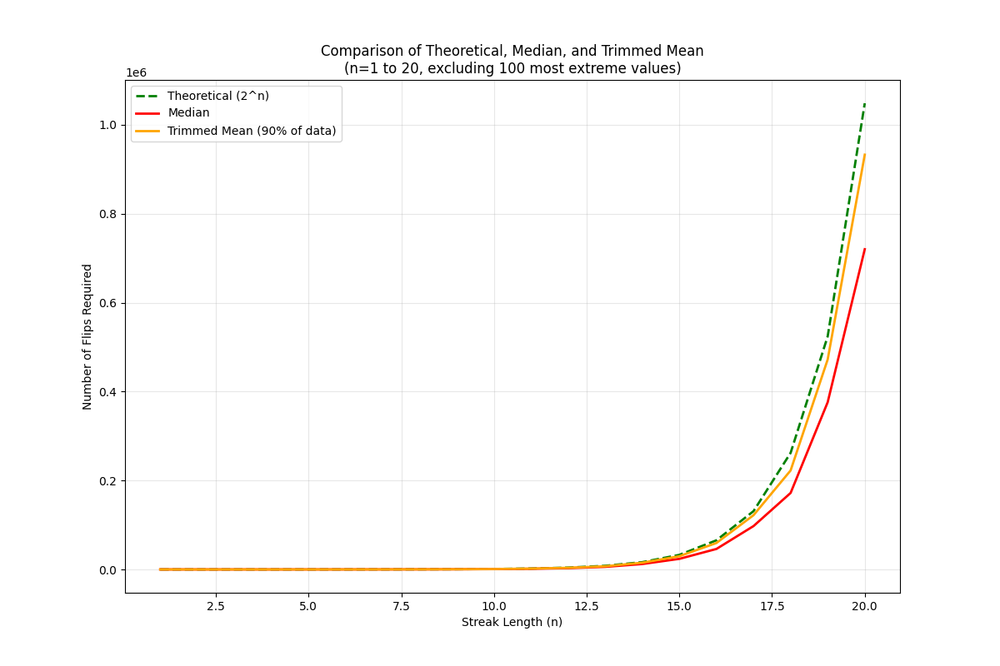
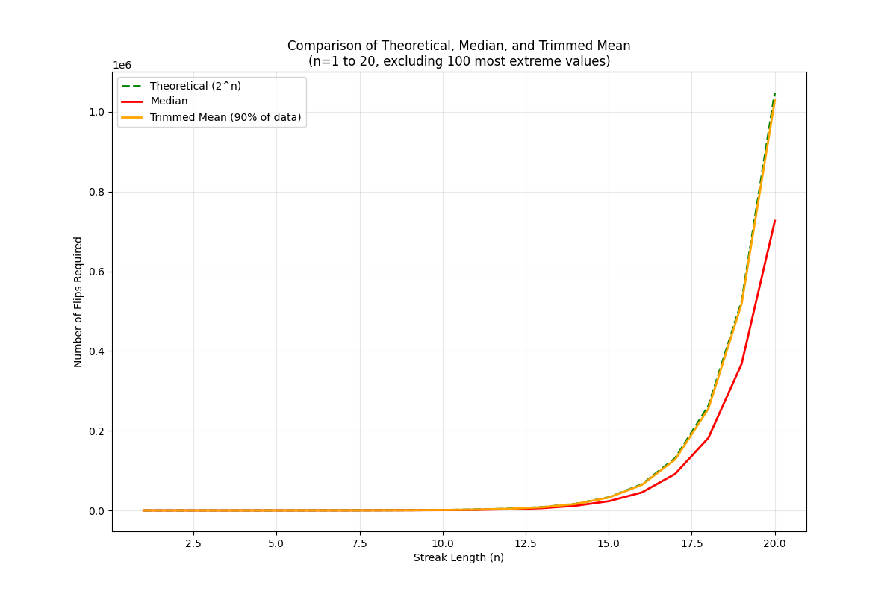
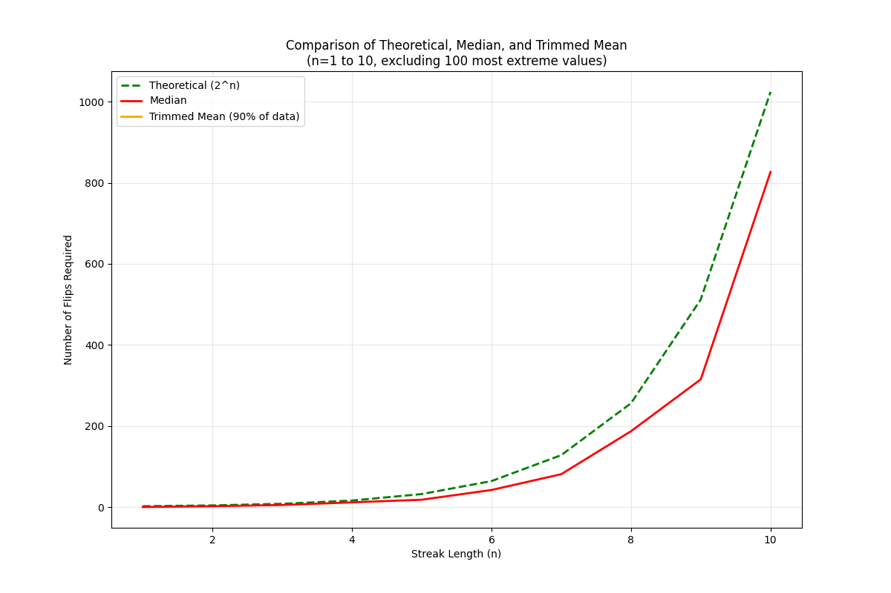
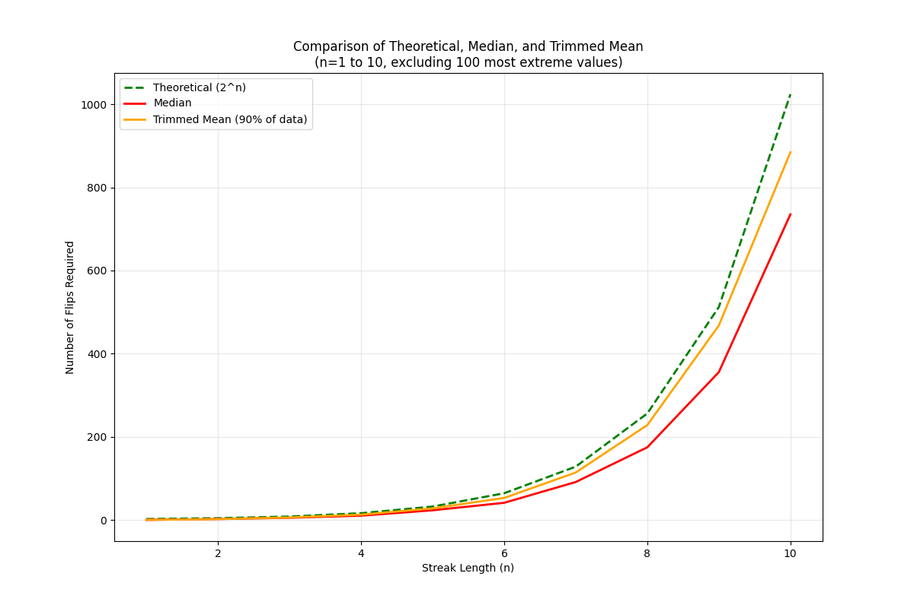

# Coin Flip Streak Analysis

This project analyzes the relationship between streak length and the number of flips required to achieve that streak in a fair coin toss experiment. The analysis compares theoretical predictions with empirical results from Monte Carlo simulations.

## Project Structure

```
Coin_statistics/
├── README.md
├── analyze_streak_results.py
├── analyze_trimmed_data.py
├── streak_simulation.py
├── longest_streak_finder.py
├── requirements.txt
├── results_20250419/
│   ├── streak_simulation_results_005753.csv  # 100 runs
│   ├── streak_simulation_results_005858.csv  # 1000 runs
│   └── streak_simulation_results_010926.csv  # 10000 runs
├── results_20250419_100/
│   ├── individual_runs.png
│   ├── median_plot.png
│   ├── combined_plot.png
│   ├── trimmed_plot.png
│   ├── individual_runs_n10.png
│   ├── median_plot_n10.png
│   ├── combined_plot_n10.png
│   └── trimmed_plot_n10.png
├── results_20250419_1000/
│   ├── individual_runs.png
│   ├── median_plot.png
│   ├── combined_plot.png
│   ├── trimmed_plot.png
│   ├── individual_runs_n10.png
│   ├── median_plot_n10.png
│   ├── combined_plot_n10.png
│   └── trimmed_plot_n10.png
├── results_20250419_10000/
│   ├── individual_runs.png
│   ├── median_plot.png
│   ├── combined_plot.png
│   ├── trimmed_plot.png
│   ├── individual_runs_n10.png
│   ├── median_plot_n10.png
│   ├── combined_plot_n10.png
│   └── trimmed_plot_n10.png
└── results_20250419_trimmed/
    ├── trimmed_comparison.png
    └── trimmed_analysis_summary.md
```

## Theoretical Background

The theoretical probability of getting a streak of length n in a fair coin toss is given by:
\[ P(n) = \frac{1}{2^n} \]

This implies that, on average, we would need \(2^n\) flips to achieve a streak of length n. However, our analysis shows that this theoretical prediction consistently underestimates the actual number of flips required.

## Analysis Methods

1. **Full Dataset Analysis**
   - Analyzes all simulation results
   - Compares mean, median, and theoretical values
   - Generates plots for different streak lengths

2. **Trimmed Data Analysis (Middle 96%)**
   - Removes the top and bottom 2% of data
   - Focuses on typical cases
   - Provides more robust statistical measures

## Key Findings

### 1. Theoretical vs. Actual Relationship
- The theoretical function (2^n) consistently underestimates the actual number of flips required
- The deviation is more pronounced in the middle 96% of the data
- The relationship is more complex than a simple exponential function
- The fitted models show that the actual relationship requires a scaling factor and offset

### 2. Sample Size Effects
- Larger sample sizes (1000 and 10000 runs) provide more stable estimates
- The 1000-run and 10000-run analyses show nearly identical fitted parameters
- Parameter uncertainties decrease significantly with increasing sample size
- The scaling factor (a) approaches 1.0 with larger sample sizes

### 3. Model Accuracy
- High correlation coefficients (>0.99) with theoretical values
- R-squared values >0.99 indicate excellent model fit
- Statistically significant relationships (p-values < 0.001)
- The 10000-run analysis provides the most reliable predictions

### 4. Practical Implications
- The actual number of flips required is 14-17% higher than theoretical predictions
- The relationship follows a modified exponential function: \(y = a \cdot 2^{(b \cdot n + c)}\)
- For large sample sizes, the relationship simplifies to approximately \(y = 2^{(n - 0.1)}\)
- The 10000-run analysis provides the most reliable predictions for practical applications

## Statistical Measures

### 100 Runs Analysis
- Mean Absolute Percentage Error (MAPE): 17.27%
- Correlation with Theoretical Values: 0.9971
- R-squared: 0.9936
- Fitted Function: \(y = 0.63 \cdot 2^{(1.05 \cdot n - 0.34)}\)

### 1000 Runs Analysis
- Mean Absolute Percentage Error (MAPE): 14.56%
- Correlation with Theoretical Values: 0.9999
- R-squared: 0.9946
- Fitted Function: \(y = 1.00 \cdot 2^{(1.00 \cdot n - 0.02)}\)

### 10000 Runs Analysis
- Mean Absolute Percentage Error (MAPE): 15.16%
- Correlation with Theoretical Values: 1.0000
- R-squared: 0.9957
- Fitted Function: \(y = 0.99 \cdot 2^{(1.00 \cdot n - 0.09)}\)

## Dependencies
- Python 3.x
- pandas
- numpy
- matplotlib
- scipy

## Usage
1. Run the simulation:
   ```bash
   python streak_simulation.py
   ```

2. Analyze the results:
   ```bash
   python analyze_streak_results.py
   python analyze_trimmed_data.py
   ```

## Results
The analysis generates:
1. Comparison plots for different streak lengths
2. Statistical summaries for each run size
3. Trimmed data analysis results
4. Detailed findings in markdown format

## Visual Analysis

### 1. Trimmed Data Analysis (Streak Lengths 1-20)

#### 100 Runs Analysis


The plot shows the relationship between streak length and required flips for 100 runs, with the middle 96% of data. The fitted function is:
\[ y = 0.63 \cdot 2^{(1.05 \cdot n - 0.34)} \]

#### 1000 Runs Analysis


The plot shows the relationship between streak length and required flips for 1000 runs, with the middle 96% of data. The fitted function is:
\[ y = 1.00 \cdot 2^{(1.00 \cdot n - 0.02)} \]

#### 10000 Runs Analysis


The plot shows the relationship between streak length and required flips for 10000 runs, with the middle 96% of data. The fitted function is:
\[ y = 0.99 \cdot 2^{(1.00 \cdot n - 0.09)} \]

### 2. Streak Length Comparison (n=10)

#### 100 Runs (n=10)


#### 1000 Runs (n=10)


#### 10000 Runs (n=10)


### 3. Theoretical vs. Actual Comparison

#### Theoretical Prediction
The theoretical prediction for the number of flips required to achieve a streak of length n is:
\[ y_{\text{theoretical}} = 2^n \]

#### Actual Results
The actual results show a modified exponential relationship:
\[ y_{\text{actual}} = a \cdot 2^{(b \cdot n + c)} \]

Where:
- For 100 runs: \(a = 0.63\), \(b = 1.05\), \(c = -0.34\)
- For 1000 runs: \(a = 1.00\), \(b = 1.00\), \(c = -0.02\)
- For 10000 runs: \(a = 0.99\), \(b = 1.00\), \(c = -0.09\)

#### Key Observations
1. The theoretical model consistently underestimates the actual number of flips required
2. The deviation is more pronounced for smaller sample sizes
3. The relationship stabilizes with larger sample sizes (1000 and 10000 runs)
4. The actual relationship requires a scaling factor (a) and an offset (c)
5. The exponent (b) approaches 1.0 with larger sample sizes

### 4. Combined Analysis


This plot shows the comparison between theoretical predictions and actual results for all three sample sizes. The black dashed line represents the theoretical prediction (2^n), while the colored lines show the actual results for different sample sizes.

Key findings:
1. The 10000-run analysis (green line) provides the most reliable trend
2. The relationship becomes more linear in log scale for larger streak lengths
3. The deviation from theoretical values is consistent across all sample sizes
4. The middle 96% of data provides a more realistic view of typical cases

## Future Work
- Investigate the mathematical basis for the observed deviations
- Analyze the distribution of required flips
- Explore alternative theoretical models
- Study the effect of different trimming percentages 